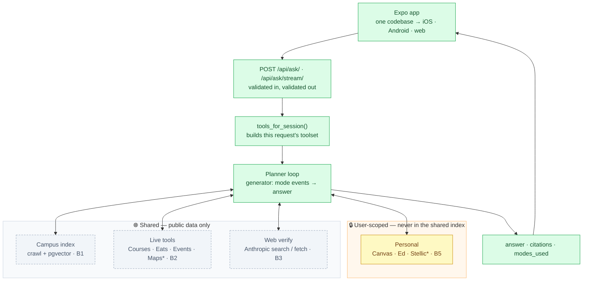

# Architecture

🟩 built  ·  🟨 scaffold, client stubbed  ·  ⬜ not built  ·  `*` mock, labelled in UI

---

## Five invariants

Every safety rule is enforced **by construction**, not by convention.

| | Rule | Mechanism |
|---|---|---|
| 1 | Public tools can't see personal data | `Tool.run()` only passes `session_id` to connector-gated tools |
| 2 | The planner can't call what it wasn't offered | `tools_for_session()` builds the array per request |
| 3 | The model names, never authors | citations collected by code; model emits `[S1]` |
| 4 | A mock can't look live | `is_mock` derives from the producing tool |
| 5 | A bad answer fails in the backend | response serializers validate on the way out |

---

## Where things live

| | |
|---|---|
| `backend/apps/core/` | endpoints, contract, errors, threads |
| `backend/apps/tools/` | tool registry, source registry |
| `backend/apps/personal/` | encrypted connectors |
| `backend/apps/planner/` | the agentic loop, prompt, citations |
| `backend/apps/rag/` | not created yet |
| `frontend/app/` | the whole app, all three platforms |

---

## Deeper plans

| Doc | Covers |
|---|---|
| [PRD.md](./PRD.md) | product, scope, sources, non-goals |
| [b4-planner.md](./b4-planner.md) | planner loop, citations, streaming, inline-citation UI |
| [b3-web-verify.md](./b3-web-verify.md) | web verify — implementation prompt, ready to hand over |
| [artifact-plan.md](./artifact-plan.md) | maps / plan graphs / schedules — draft |
| [../tasklist.md](../tasklist.md) | the API contract (§2) and every task |
| [runbook.md](./runbook.md) | running it |
| [dependencies.md](./dependencies.md) | every dependency, and why |
