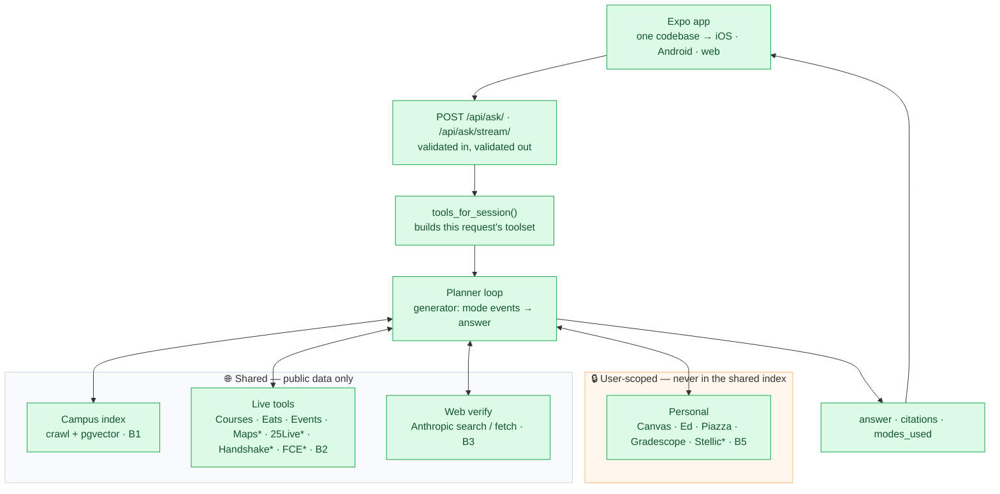

# Architecture

What is actually built, and the invariants that keep it honest.

🟩 built  ·  `*` mock — `is_mock: true` on every citation it produces, though
nothing renders that as a badge yet (see [Known gaps](#known-gaps))

**24 tools are registered:** 10 public (`campus_search`, Courses ×2, Dining,
Events, Maps ×2, 25Live, Handshake, FCE) and 14 user-scoped (Canvas ×3, Ed ×3,
Piazza ×2, Gradescope, Stellic mock, plus four demo stand-ins). Web search and
fetch are not in that count — they arrive with the platform's prebuilt toolset
rather than being registered by us.

**What the shipped index actually holds:** 174 documents / 1,439 embedded chunks,
all under `www.cmu.edu`, restored from `../backend/fixtures/rag_index.sql.gz` so a
fresh clone answers public questions without waiting on a crawl. The crawler
reaches wider than that — 33 seeds, including the college sites, the course
catalog, `computing.cmu.edu` and cmu.guide — but those are seeds a re-crawl would
follow, not pages already in the index. PRD §4 lists them as intent; only
`www.cmu.edu` is indexed today.

---

## Five invariants

Every safety rule is enforced **by construction**, not by convention.

| | Rule | Mechanism |
|---|---|---|
| 1 | Public tools can't see personal data | `Tool.run()` only passes `session_id` to connector-gated tools |
| 2 | The planner can't call what it wasn't offered | `tools_for_session()` builds the array per request |
| 3 | The model names, never authors | citations collected by code; model emits `[S1]` |
| 4 | A mock can't look live *(in the data — see the gap below)* | `is_mock` derives from the producing tool, never from what the tool claims |
| 5 | A bad answer fails in the backend | response serializers validate on the way out |

All five hold on Managed Agents, because every mechanism in the right-hand column
is code that runs on our side. Anthropic drives the loop; it never executes a
tool, so `run_tool` is still the only door.

Invariant 2 takes a different shape there without losing substance: the array
`tools_for_session()` returns is passed per *session*, as an
`agent_with_overrides` toolset, rather than per request. A session outlives the
turn, so it can be holding a toolset built before somebody connected or
disconnected a source; the driver re-applies the current one on every follow-up.
That is tidiness rather than the guarantee — `run_tool` re-checks the connector on
**every** dispatch, so a stale offer returns an error, never someone's data.

A demo stand-in (`canvas_sample` and friends) is a third category, neither public
nor personal: it is offered only while its real provider is *un*connected, takes
no `session_id`, and stamps `is_mock` on everything it returns.

---

## Known gaps

Stated here rather than left for someone to discover.

**The mock badge is not rendered.** Invariant 4 holds in the data and stops
halfway to the screen. Every citation from a mock tool carries `is_mock: true`,
derived from the tool's own registration; it survives the serializer, `lib/api.ts`
and `lib/types.ts` — and then nothing draws it.
`../frontend/app/components/CitationCard.tsx` says so in its own docstring: the
flag reaches the console and no further. **PRD §10 rule 3 requires a visible
label, so this is an accepted deviation, not an oversight** — but it is a real one,
and a Maps or 25Live or Stellic answer is presented today with nothing marking it
as fixture data. The backend half is done; the badge is a `CitationCard` change.

**The index is one host wide.** 174 pages of `www.cmu.edu`, against a crawler and
a 33-seed list that reach much further. Nothing false is claimed by it — a
citation always links the page it came from — but "the campus corpus" is narrower
than PRD §4's table implies. See the counts above.

**`resolve_course_site` is not built.** PRD §6 lists it; `15-213` → seeded
homepage is currently the model's job via search, not a static map.

---

## Where things live

| | |
|---|---|
| [`../backend/apps/core/`](../backend/apps/core/) | endpoints, contract, errors, threads |
| [`../backend/apps/rag/`](../backend/apps/rag/) | crawler, chunker, embedder, hybrid search, `campus_search` |
| [`../backend/apps/tools/`](../backend/apps/tools/) | tool registry, source registry, the live tools and mocks |
| [`../backend/apps/personal/`](../backend/apps/personal/) | encrypted connectors |
| [`../backend/apps/planner/`](../backend/apps/planner/) | the session driver, prompt, citations — see [b4-planner.md](./b4-planner.md) |
| [`../frontend/app/`](../frontend/app/) | the whole app, all three platforms |

---

## Deeper plans

| Doc | Covers |
|---|---|
| [PRD.md](./PRD.md) | product, scope, sources, non-goals, the hard rules (§10) |
| [b4-planner.md](./b4-planner.md) | planner loop, citations, streaming, inline-citation UI |
| [b3-web-verify.md](./b3-web-verify.md) | web verify, RAG and live-tool citations — all five parts landed |
| [artifact-plan.md](./artifact-plan.md) | maps / plan graphs / schedules — draft |
| [../tasklist.md](../tasklist.md) | the API contract (§2) and every task |
| [runbook.md](./runbook.md) | running it |
| [dependencies.md](./dependencies.md) | every dependency, and why |
